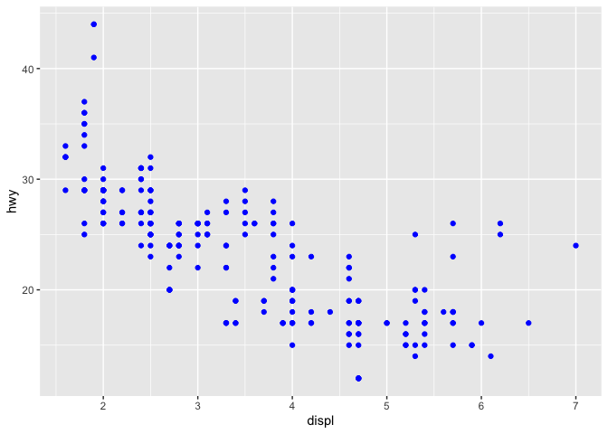
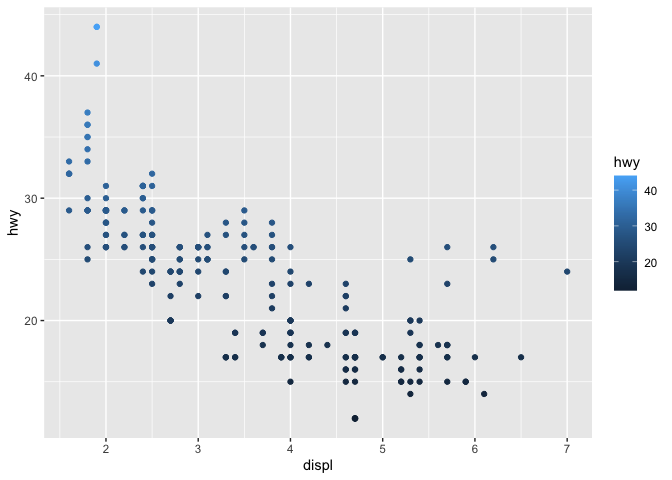
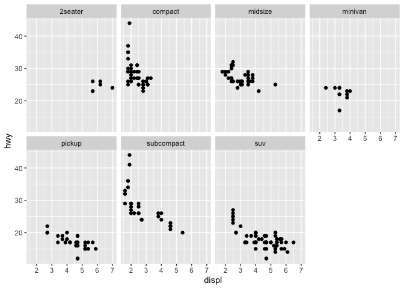
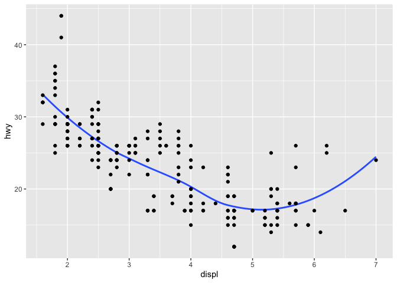
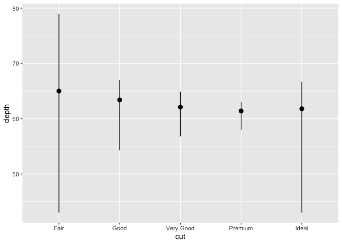

R for Data Science Chapter 3
================

``` r
library(tidyverse)
```

    ## ── Attaching packages ─────────────────────────────────────── tidyverse 1.3.0 ──

    ## ✓ ggplot2 3.3.2     ✓ purrr   0.3.4
    ## ✓ tibble  3.0.1     ✓ dplyr   1.0.0
    ## ✓ tidyr   1.1.0     ✓ stringr 1.4.0
    ## ✓ readr   1.3.1     ✓ forcats 0.5.0

    ## ── Conflicts ────────────────────────────────────────── tidyverse_conflicts() ──
    ## x dplyr::filter() masks stats::filter()
    ## x dplyr::lag()    masks stats::lag()

# 3.2 First Steps

Answer the question do cars with big engines use more fuel than cars
with small engines?

``` r
mpg
```

    ## # A tibble: 234 x 11
    ##    manufacturer model    displ  year   cyl trans   drv     cty   hwy fl    class
    ##    <chr>        <chr>    <dbl> <int> <int> <chr>   <chr> <int> <int> <chr> <chr>
    ##  1 audi         a4         1.8  1999     4 auto(l… f        18    29 p     comp…
    ##  2 audi         a4         1.8  1999     4 manual… f        21    29 p     comp…
    ##  3 audi         a4         2    2008     4 manual… f        20    31 p     comp…
    ##  4 audi         a4         2    2008     4 auto(a… f        21    30 p     comp…
    ##  5 audi         a4         2.8  1999     6 auto(l… f        16    26 p     comp…
    ##  6 audi         a4         2.8  1999     6 manual… f        18    26 p     comp…
    ##  7 audi         a4         3.1  2008     6 auto(a… f        18    27 p     comp…
    ##  8 audi         a4 quat…   1.8  1999     4 manual… 4        18    26 p     comp…
    ##  9 audi         a4 quat…   1.8  1999     4 auto(l… 4        16    25 p     comp…
    ## 10 audi         a4 quat…   2    2008     4 manual… 4        20    28 p     comp…
    ## # … with 224 more rows

Lets try plotting the cars efficiency (`hwy`) vs. it’s car engine size
in liters (`displ`)

``` r
ggplot(data = mpg) +
  geom_point(mapping = aes(x = displ, y = hwy))
```

<!-- -->

## 3.2.4 Exercises

1.  Run `ggplot(data = mpg)`. What do you see?

<!-- end list -->

``` r
ggplot(data = mpg)
```

<!-- -->

An empty canvas

2.  How many rows are in `mpg`? How many columns?

<!-- end list -->

``` r
mpg
```

    ## # A tibble: 234 x 11
    ##    manufacturer model    displ  year   cyl trans   drv     cty   hwy fl    class
    ##    <chr>        <chr>    <dbl> <int> <int> <chr>   <chr> <int> <int> <chr> <chr>
    ##  1 audi         a4         1.8  1999     4 auto(l… f        18    29 p     comp…
    ##  2 audi         a4         1.8  1999     4 manual… f        21    29 p     comp…
    ##  3 audi         a4         2    2008     4 manual… f        20    31 p     comp…
    ##  4 audi         a4         2    2008     4 auto(a… f        21    30 p     comp…
    ##  5 audi         a4         2.8  1999     6 auto(l… f        16    26 p     comp…
    ##  6 audi         a4         2.8  1999     6 manual… f        18    26 p     comp…
    ##  7 audi         a4         3.1  2008     6 auto(a… f        18    27 p     comp…
    ##  8 audi         a4 quat…   1.8  1999     4 manual… 4        18    26 p     comp…
    ##  9 audi         a4 quat…   1.8  1999     4 auto(l… 4        16    25 p     comp…
    ## 10 audi         a4 quat…   2    2008     4 manual… 4        20    28 p     comp…
    ## # … with 224 more rows

Looks like 234 rows and 11 columns

3.  What does the drv variable describe? Read the help for ?mpg to find
    out

<!-- end list -->

``` r
?mpg
```

What type of drive train a car has.

4.  Make a scatterplot of `hwy` vs. `cyl`

<!-- end list -->

``` r
ggplot(data = mpg, aes(y = hwy, x = cyl)) + geom_point()
```

<!-- -->

5.  What happens if you make a scatterplot of `class` vs. `drv`? Why is
    the plot not useful?

<!-- end list -->

``` r
ggplot(data = mpg, aes(y = class, x = drv)) + geom_point()
```

<!-- -->

It’s not useful because you are plotting two different categorical
variables against each other. It might make more sense to represent the
data as a count of each combination of categories:

``` r
ggplot(data = mpg, aes(x = class, fill = drv)) + geom_bar()
```

<!-- -->

# 3.3 Aesthetic mappings

Can we explain the points that don’t fit the general trend using another
categorical variable? Do we expect these values to be, say, hybrid cars?

Use aesthetics to change the color of the points to indicate the
different classes of cars.

``` r
ggplot(data = mpg) + 
  geom_point(mapping = aes(x = displ, y = hwy, color = class))
```

<!-- -->

It looks like the outliers are all two-seaters. These are usually sports
cars which have big engines for small body sizes and therefore get
slightly better gas mileage.

We can also change the class to be marked by size. But this doesn’t
really make sense does it? There is no value associated with being an
SUV vs. a 2seater. Thus, assigning a size doesn’t really work and R
warns us.

``` r
ggplot(data = mpg) +
  geom_point(mapping = aes(x = displ, y = hwy, size = class))
```

    ## Warning: Using size for a discrete variable is not advised.

<!-- -->

We can also change the transparency or shape of the points as well.
However, transparency falls under the same nonsense as size for this
particular data.

``` r
# Left
ggplot(data = mpg) +
  geom_point(mapping = aes(x = displ, y = hwy, alpha = class))
```

    ## Warning: Using alpha for a discrete variable is not advised.

<!-- -->

``` r
# Right
ggplot(data = mpg) +
  geom_point(mapping = aes(x = displ, y = hwy, shape = class))
```

    ## Warning: The shape palette can deal with a maximum of 6 discrete values because
    ## more than 6 becomes difficult to discriminate; you have 7. Consider
    ## specifying shapes manually if you must have them.

    ## Warning: Removed 62 rows containing missing values (geom_point).

<!-- -->

For the shapes R is warning us that more than 6 shapes is hard to
discriminate and therefore it drops the seventh category. It wants us to
manually specify shape instead. Which we haven’t learned how to do yet.

We can also change the overall color of all the points by specifying it
outside the the aesthetic mapping

``` r
ggplot(data = mpg) +
  geom_point(mapping = aes(x = displ, y = hwy), color = "blue")
```

<!-- -->

Other things you can change are \* Name of a color as a character
string. \* Size of a point in mm \* Shape of a point as a number (R has
25 built in shapes)

## 3.3.1 Exercises

1.  What’s gone wrong with this code? Why are the points not blue?

<!-- end list -->

``` r
ggplot(data = mpg) +
  geom_point(mapping = aes(x = displ, y = hwy, color = "blue"))
```

<!-- -->

The color specification was put inside aesthetic instead of outside it,
so the function treated it as a categorical variable

2.  Which variables in `mpg` are categorical? Which variables are
    continuous? (Hint: type `? mpg` to read the documentation for the
    data set). How can you see this information when you run `mpg`?

<!-- end list -->

``` r
mpg
```

    ## # A tibble: 234 x 11
    ##    manufacturer model    displ  year   cyl trans   drv     cty   hwy fl    class
    ##    <chr>        <chr>    <dbl> <int> <int> <chr>   <chr> <int> <int> <chr> <chr>
    ##  1 audi         a4         1.8  1999     4 auto(l… f        18    29 p     comp…
    ##  2 audi         a4         1.8  1999     4 manual… f        21    29 p     comp…
    ##  3 audi         a4         2    2008     4 manual… f        20    31 p     comp…
    ##  4 audi         a4         2    2008     4 auto(a… f        21    30 p     comp…
    ##  5 audi         a4         2.8  1999     6 auto(l… f        16    26 p     comp…
    ##  6 audi         a4         2.8  1999     6 manual… f        18    26 p     comp…
    ##  7 audi         a4         3.1  2008     6 auto(a… f        18    27 p     comp…
    ##  8 audi         a4 quat…   1.8  1999     4 manual… 4        18    26 p     comp…
    ##  9 audi         a4 quat…   1.8  1999     4 auto(l… 4        16    25 p     comp…
    ## 10 audi         a4 quat…   2    2008     4 manual… 4        20    28 p     comp…
    ## # … with 224 more rows

Can see the datatype underneath the variable name. Chr are character
values which can be treated as categorical. Similarly int are integers
which can be treated either continuously or as categorical. dbl are
float numbers which are continuous.

3.  Map a continuous variable to `color`, `size`, and `shape`. How do
    these aesthetics behave differently for categorial vs. continuous
    variables?

<!-- end list -->

``` r
ggplot(data = mpg) + geom_point(aes(x = displ, y = hwy, color = hwy))
```

<!-- -->

Color changes to a gradient instead of discrete colors

``` r
ggplot(data = mpg) + geom_point(aes(x = displ, y = hwy, shape = hwy))
```

    ## Error: A continuous variable can not be mapped to shape

<!-- -->

Shape will not work

``` r
ggplot(data = mpg) + geom_point(aes(x = displ, y = hwy, size = hwy))
```

<!-- -->

Size also gets mapped onto a continuous scale

4.  What happens if you map the same variable to multiple aesthetics?

<!-- end list -->

``` r
ggplot(data = mpg) + geom_point(aes(x = displ, y = hwy, size = hwy, color = hwy))
```

<!-- -->

The value gets mapped to both aesthetics

5.  What does the `stroke` aesthetic do? What shapes does it work with?
    (Hint: use `? geom_point`) The information about stroke can be found
    in `vignette("ggplot2-specs")` which was found after looking at the
    `? geom_point` documentation. IN there it says that stroke controls
    the outside of a shape only for shapes 21-24. Lets try setting the
    stroke.

<!-- end list -->

``` r
ggplot(data = mpg) + geom_point(aes(x = displ, y = hwy), shape = 21, stroke = 4)
```

<!-- -->

6.  What happens if you map an aesthetic to something other than a
    variable name, like `aes(colour = displ < 5)`? Note, you’ll also
    need to specify x and y.

<!-- end list -->

``` r
ggplot(data = mpg) + geom_point(aes(x = displ, y = hwy, color = displ < 5))
```

<!-- -->

It takes the solution to displ \< 5 as the categorical variable for the
plotting

# 3.5 Facets

We could add additional variables with the aesthetics, but it might be
better to split the data into facets. Allowing us to plot the same thing
over a series of different categories.

Here is an example of plotting the `hwy` vs. `displ` for each class of
vehicle

``` r
ggplot(data = mpg) +
  geom_point(mapping = aes(x = displ, y = hwy)) +
  facet_wrap(~ class, nrow = 2)
```

<!-- -->

What if we want to facet on two different sets of variables? Here we
will split on the number of cylinders on the x and the type of
drive-train on the y.

``` r
ggplot(data = mpg) +
  geom_point(mapping = aes(x = displ, y = hwy)) +
  facet_grid(drv ~ cyl)
```

<!-- -->

## 3.5.1 Exercises

1.  What happens if you facet on a continuous variable?

<!-- end list -->

``` r
mpg
```

    ## # A tibble: 234 x 11
    ##    manufacturer model    displ  year   cyl trans   drv     cty   hwy fl    class
    ##    <chr>        <chr>    <dbl> <int> <int> <chr>   <chr> <int> <int> <chr> <chr>
    ##  1 audi         a4         1.8  1999     4 auto(l… f        18    29 p     comp…
    ##  2 audi         a4         1.8  1999     4 manual… f        21    29 p     comp…
    ##  3 audi         a4         2    2008     4 manual… f        20    31 p     comp…
    ##  4 audi         a4         2    2008     4 auto(a… f        21    30 p     comp…
    ##  5 audi         a4         2.8  1999     6 auto(l… f        16    26 p     comp…
    ##  6 audi         a4         2.8  1999     6 manual… f        18    26 p     comp…
    ##  7 audi         a4         3.1  2008     6 auto(a… f        18    27 p     comp…
    ##  8 audi         a4 quat…   1.8  1999     4 manual… 4        18    26 p     comp…
    ##  9 audi         a4 quat…   1.8  1999     4 auto(l… 4        16    25 p     comp…
    ## 10 audi         a4 quat…   2    2008     4 manual… 4        20    28 p     comp…
    ## # … with 224 more rows

``` r
ggplot(data = mpg, aes(x = cyl, y = hwy)) + geom_point() + facet_wrap(~ displ)
```

<!-- -->

It still plots a plot for every single value.

2.  What do the empty cells in a plot with `facet_grid(drv ~ cyl)` mean?

<!-- end list -->

``` r
ggplot(data = mpg, aes(x = displ, y = hwy)) + geom_point() + facet_grid(drv ~ cyl)
```

<!-- -->

The empty plots mean you have no data for that location.

How do they relate to this plot?

``` r
ggplot(data = mpg) +
  geom_point(mapping = aes(x = drv, y = cyl))
```

<!-- -->

They are the locations you have no data.

3.  What plots does the following code make? What does `.` do?

<!-- end list -->

``` r
ggplot(data = mpg) +
  geom_point(mapping = aes(x = displ, y = hwy)) +
  facet_grid(drv ~ .)
```

<!-- -->

``` r
ggplot(data = mpg) +
  geom_point(mapping = aes(x = displ, y = hwy)) +
  facet_grid(. ~ cyl)
```

<!-- -->

The dot appears to say don’t plot anything for that dimension.

4.  Take the first faceted plot in this section:

<!-- end list -->

``` r
ggplot(data = mpg) +
  geom_point(mapping = aes(x = displ, y = hwy)) +
  facet_wrap(~ class, nrow = 2)
```

<!-- -->

Advantages, allows you to seperate out each group and consider
individually. Disadvantages, can’t see how well the groups fit in the
data overall. Balancing - why not plot both?

5.  Read `?facet_wrap`. What does `nrow` do? What does `ncol` do?

`nrow` and `ncol` change the number of rows and columns respectively

What other options control the layout of the individual panels?

`drop` allows you to drop categorical values that don’t show up `dir`
allows you to switch between vertical and horizontal wrapping

Why doesn’t `facet_grid()` have `nrow` and `ncol` arguments?

Because the rows and columns are set by your data.

6.  When using `facet_grid()` you should usually put the variable with
    more unique levels in the columns. Why?

Screens are typically rectangular so you have more space wide then you
do tall

# 3.6 Geometric objects

Can change the type of plot by changing the geom

``` r
#left
ggplot(data = mpg) +
  geom_point(mapping = aes(x = displ, y = hwy))
```

<!-- -->

``` r
# right
ggplot(data = mpg) +
  geom_smooth(mapping = aes(x= displ, y = hwy))
```

    ## `geom_smooth()` using method = 'loess' and formula 'y ~ x'

<!-- -->

How can we change the aesthetics of the smooth fit?

``` r
ggplot(data = mpg) +
  geom_smooth(mapping = aes(x = displ, y = hwy, linetype = drv))
```

    ## `geom_smooth()` using method = 'loess' and formula 'y ~ x'

<!-- -->

This is weird, what if we plotted this over top of the actual data that
goes with each drivetrain? How can we do that? We will find out soon.

First lets play with the grouping of data. In the plot above we changed
the linestyle for drivetrain giving us a distinguishing feature for each
group. What if we want all the groups to look the same?

``` r
ggplot(data = mpg) +
  geom_smooth(mapping = aes(x = displ, y = hwy))
```

    ## `geom_smooth()` using method = 'loess' and formula 'y ~ x'

<!-- -->

Now lets just group by drive train

``` r
ggplot(data = mpg) +
  geom_smooth(mapping = aes(x = displ, y = hwy, group = drv))
```

    ## `geom_smooth()` using method = 'loess' and formula 'y ~ x'

<!-- -->

Lets instead change the color for each but don’t put a legend

``` r
ggplot(data = mpg) +
  geom_smooth(
    mapping = aes(x = displ, y = hwy, color = drv),
    show.legend = FALSE
  )
```

    ## `geom_smooth()` using method = 'loess' and formula 'y ~ x'

<!-- -->

Now lets plot the data with the overall fit:

``` r
ggplot(data = mpg) +
  geom_point(mapping = aes(x = displ, y = hwy)) +
  geom_smooth(mapping = aes(x = displ, y = hwy))
```

    ## `geom_smooth()` using method = 'loess' and formula 'y ~ x'

<!-- -->

However, this introduces duplication in the code and could lead to
mistakes when one goes to change things. Lets instead put the mapping in
the ggplot call

``` r
ggplot(data = mpg, mapping = aes(x= displ, y = hwy)) +
  geom_point() +
  geom_smooth()
```

    ## `geom_smooth()` using method = 'loess' and formula 'y ~ x'

<!-- -->

Now we can overwrite a local layer seperately from the overall layer

``` r
ggplot(data = mpg, mapping = aes(x = displ, y = hwy)) +
  geom_point(mapping = aes(color = class)) +
  geom_smooth()
```

    ## `geom_smooth()` using method = 'loess' and formula 'y ~ x'

<!-- -->

Now what if we wanted to show the all the data but only the fit for the
subcompact class? We can feed only the subcompact data within
geom\_smooth but keep everything else the same

``` r
ggplot(data = mpg, mapping = aes(x = displ, y = hwy)) +
  geom_point(mapping = aes(color = class)) +
  geom_smooth(data = filter(mpg, class == "subcompact"), se = FALSE)
```

    ## `geom_smooth()` using method = 'loess' and formula 'y ~ x'

<!-- -->

# 3.6.1 Exercises

1.  What geom would you use to draw a line chart? A boxplot? A
    histogram? An area chart?

<!-- end list -->

  - `geom_line()`
  - `geom_boxplot()`
  - `geom_hist()`
  - `geom_area()`

<!-- end list -->

2.  Run this code in your head and predict what the output will look
    like. Then, run the code in R and check your predictions.

<!-- end list -->

``` r
ggplot(mpg, aes(x = hwy, y = cty)) + geom_area()
```

<!-- -->

``` r
ggplot(data = mpg, mapping = aes(x = displ, y = hwy, color = drv)) +
  geom_point() +
  geom_smooth(se = FALSE)
```

    ## `geom_smooth()` using method = 'loess' and formula 'y ~ x'

<!-- -->

Should draw loess lines for each individual class

3.  What does `show.legend = FALSE` do?

doesn’t show the legend for a layer

What happens if you remove it?

The legend shows up for that layer

Why do you think it was used earlier in the chapter?

To remove the legend.

4.  What does the `se` argument to `geom_smooth()` do?

Removes the confidence interval estimate of the smooth line. Default of
se is a 0.95 confidence interval

5.  Will these two graphs look different? Why/why not?

<!-- end list -->

``` r
ggplot(data = mpg, mapping = aes(x = displ, y = hwy)) +
  geom_point() +
  geom_smooth()
```

    ## `geom_smooth()` using method = 'loess' and formula 'y ~ x'

<!-- -->

``` r
ggplot() +
  geom_point(data = mpg, mapping = aes(x = displ, y = hwy)) +
  geom_smooth(data = mpg, mapping = aes(x = displ, y = hwy))
```

    ## `geom_smooth()` using method = 'loess' and formula 'y ~ x'

<!-- -->

Yes but the second one is redundant.

6.  Recreate the R code necessary to generate the following graphs.

<!-- end list -->

``` r
ggplot(data = mpg, aes(x = displ, y= hwy)) +
  geom_smooth(se = FALSE) + geom_point()
```

    ## `geom_smooth()` using method = 'loess' and formula 'y ~ x'

<!-- -->

``` r
ggplot(data = mpg, aes(x = displ, y = hwy)) +
  geom_point() +
  geom_smooth(aes(group = drv), color = "red", se = FALSE)
```

    ## `geom_smooth()` using method = 'loess' and formula 'y ~ x'

<!-- -->

``` r
ggplot(data = mpg, aes(x = displ, y = hwy, color = drv)) + geom_point() +
  geom_smooth(se = FALSE)
```

    ## `geom_smooth()` using method = 'loess' and formula 'y ~ x'

<!-- -->

``` r
ggplot(data = mpg, aes(x = displ, y = hwy,
              color = drv)) +
  geom_point() +
  geom_smooth(aes(color=NULL), se = FALSE)
```

    ## `geom_smooth()` using method = 'loess' and formula 'y ~ x'

<!-- -->

``` r
ggplot(data = mpg, aes(x = displ, y = hwy)) +
  geom_point(aes(color = drv)) +
  geom_smooth(se = FALSE)
```

    ## `geom_smooth()` using method = 'loess' and formula 'y ~ x'

<!-- -->

``` r
ggplot(data = mpg, aes(x = displ, y = hwy,
                       color = drv)) +
  geom_point() +
  geom_smooth(aes(color = NULL, linetype = drv), se = FALSE)
```

    ## `geom_smooth()` using method = 'loess' and formula 'y ~ x'

<!-- -->

``` r
ggplot(data = mpg, aes(x = displ, y = hwy, color = drv)) +
  geom_point(shape = 21, aes(fill = drv), color = "white", stroke =2, size =2)
```

<!-- -->

# 3.7 Statistical transformations

Now lets look at bar charts as an intro to graphs that require
manipulation of the data

``` r
ggplot(data = diamonds) +
  geom_bar(mapping = aes(x = cut))
```

<!-- -->

Where did count come from?

``` r
diamonds
```

    ## # A tibble: 53,940 x 10
    ##    carat cut       color clarity depth table price     x     y     z
    ##    <dbl> <ord>     <ord> <ord>   <dbl> <dbl> <int> <dbl> <dbl> <dbl>
    ##  1 0.23  Ideal     E     SI2      61.5    55   326  3.95  3.98  2.43
    ##  2 0.21  Premium   E     SI1      59.8    61   326  3.89  3.84  2.31
    ##  3 0.23  Good      E     VS1      56.9    65   327  4.05  4.07  2.31
    ##  4 0.290 Premium   I     VS2      62.4    58   334  4.2   4.23  2.63
    ##  5 0.31  Good      J     SI2      63.3    58   335  4.34  4.35  2.75
    ##  6 0.24  Very Good J     VVS2     62.8    57   336  3.94  3.96  2.48
    ##  7 0.24  Very Good I     VVS1     62.3    57   336  3.95  3.98  2.47
    ##  8 0.26  Very Good H     SI1      61.9    55   337  4.07  4.11  2.53
    ##  9 0.22  Fair      E     VS2      65.1    61   337  3.87  3.78  2.49
    ## 10 0.23  Very Good H     VS1      59.4    61   338  4     4.05  2.39
    ## # … with 53,930 more rows

Its not in the diamonds dataset, its calculated from a stat. We can also
use `stat_count()` instead

``` r
ggplot(data = diamonds) +
  stat_count(mapping = aes(x = cut))
```

<!-- -->

There are three reasons why you would want to use stat explicitly

1.  Override the default stat

<!-- end list -->

``` r
demo <- tribble(
  ~cut, ~freq,
  "Fair", 1610,
  "Good", 4906,
  "Very Good", 12082,
  "Premium", 13791,
  "Ideal", 21551
)

ggplot(data = demo) +
  geom_bar(mapping = aes(x = cut, y = freq), stat = "identity")
```

<!-- -->

2.  Might want to override the default mapping from transformed
    variables to aesthetics.

<!-- end list -->

``` r
ggplot(data = diamonds) +
  geom_bar(mapping = aes(x = cut, y = stat(prop), group = 1))
```

<!-- -->

3.  Draw attention to the statistical transformation to summarize the y
    values for each x

<!-- end list -->

``` r
ggplot(data = diamonds) +
  stat_summary(
    mapping = aes(x = cut, y = depth),
    fun.ymin = min,
    fun.ymax = max,
    fun.y = median
  )
```

    ## Warning: `fun.y` is deprecated. Use `fun` instead.

    ## Warning: `fun.ymin` is deprecated. Use `fun.min` instead.

    ## Warning: `fun.ymax` is deprecated. Use `fun.max` instead.

<!-- -->

## 3.7.1 Exercises

1.  What is the default geom associated with `stat_summary()`? How could
    you rewrite the previous plot to use that geom function instead of
    the stat function?

<!-- end list -->

``` r
ggplot(data = diamonds, mapping = aes(x = cut, y = depth)) +
  geom_pointrange(stat = "summary", fun.y = median, fun.ymax = max, fun.ymin = min)
```

    ## Warning: Ignoring unknown parameters: fun.y, fun.ymax, fun.ymin

    ## No summary function supplied, defaulting to `mean_se()`

<!-- -->

2.  What does `geom_col()` do? How is it different than `geom_bar`

`geom_col()` is a shortcut for running `geom_bar` with the stat set to
identity

3.  Most geoms and stats come in pairs that are almost always used in
    concert. Read through the documentation and make a list of all the
    pairs. What do they have in common?

`stat_bin` with `geom_bar` `stat_boxplot` with `geom_boxplot`
`stat_contour` with `geom_contour`

They are usually named the same and are used by each other.

4.  What variable does `stat_smooth()` compute? What parameters control
    its behaviour?

It computes a predicted value for y, a ymin, ymax and a standard error.
Several parameters control its behavior

5.  In our proportion bar chart, we need to set `group = 1`. Why? In
    other words what is the problem with these two graphs?

<!-- end list -->

``` r
ggplot(data = diamonds) +
  geom_bar(mapping = aes(x = cut, y = ..prop..))
```

<!-- -->

Its calculating the proportion over all of the data

``` r
ggplot(data = diamonds) +
  geom_bar(mapping = aes(x = cut, fill = color, y = ..prop..))
```

<!-- -->

``` r
ggplot(data = diamonds) +
  geom_bar(mapping = aes(x = cut, y = ..prop.., fill = color, group = color))
```

<!-- -->

Still calculating the proportion over all of the data.

# 3.8 Position adjustments

We can also add color to bar charts

``` r
ggplot(data = diamonds) +
  geom_bar(mapping = aes(x = cut, color = cut))
```

<!-- -->

``` r
ggplot(data = diamonds) +
  geom_bar(mapping = aes(x = cut, fill = cut))
```

<!-- -->

Now lets change the fill to some other variable

``` r
ggplot(data = diamonds) +
  geom_bar(mapping = aes(x = cut, fill = clarity))
```

<!-- -->

There are other positions we could specify other than the default
`stack`.

``` r
ggplot(data = diamonds, mapping = aes(x = cut, fill = clarity)) +
  geom_bar(alpha = 1/5, position = "identity")
```

<!-- -->

``` r
ggplot(data = diamonds) +
  geom_bar(mapping = aes(x = cut, fill = clarity), position = "fill")
```

<!-- -->

``` r
ggplot(data = diamonds) +
  geom_bar(mapping = aes(x = cut, fill = clarity), position = "dodge")
```

<!-- -->

We can also adjust the position of other plots as well

``` r
ggplot(data = mpg) +
  geom_point(mapping = aes(x = displ, y = hwy), position = "jitter")
```

<!-- -->

## 3.8.1 Exercises

1.  What is the problem with this plot? How could you improve it?

<!-- end list -->

``` r
ggplot(data = mpg, mapping = aes(x = cty, y = hwy)) + geom_point()
```

<!-- -->

``` r
ggplot(data = mpg, mapping = aes(x = cty, y = hwy)) + geom_jitter()
```

<!-- -->

``` r
ggplot(data = mpg, mapping = aes(x = cty, y = hwy)) + geom_hex() + 
    scale_fill_gradient(trans = "log2")
```

<!-- --> 2. What
parameters to `geom_jitter()` control the amount of jittering?

width and heigth

3.  Compare and contrast `geom_jitter()` with `geom_count()`

<!-- end list -->

``` r
ggplot(data = mpg, mapping = aes(x = cty, y = hwy)) + geom_count()
```

<!-- -->

Maps the size of the points to the number of observations

4.  What’s the default position adjustment for `geom_boxplot()`? Create
    a visualization of the `mpg` dataset that demonstrates it.

<!-- end list -->

``` r
ggplot(data = mpg, mapping = aes(x = drv, y= hwy, color = class)) + 
    geom_boxplot()
```

<!-- -->

``` r
ggplot(data = mpg, mapping = aes(x = as.factor(cty), y= hwy, color = class)) + 
    geom_violin()
```

<!-- -->

# 3.9 Coordinate systems

Flipping the coordinate systems can be helpful.

``` r
ggplot(data = mpg, mapping = aes(x = class, y = hwy)) +
  geom_boxplot()
```

<!-- -->

``` r
ggplot(data = mpg, mapping = aes(x = class, y = hwy)) +
  geom_boxplot() +
  coord_flip()
```

<!-- -->

Plotting maps has some special code for it

``` r
nz <- map_data("nz")

ggplot(nz, aes(long, lat, group = group)) +
  geom_polygon(fill = "white", color = "black")
```

<!-- -->

``` r
ggplot(nz, aes(long, lat, group = group)) +
  geom_polygon(fill = "white", color = "black") +
  coord_quickmap()
```

<!-- -->

Can switch over to polar coordinates

``` r
bar <- ggplot(data = diamonds) + 
  geom_bar(
    mapping = aes(x = cut, fill = cut), 
    show.legend = FALSE,
    width = 1
  ) + 
  theme(aspect.ratio = 1) +
  labs(x = NULL, y = NULL)

bar + coord_flip()
```

<!-- -->

``` r
bar + coord_polar()
```

<!-- -->

## 3.9.1 Exercises

1.  Turn a stacked bar chart into a pie chart using `coord_polar()`

<!-- end list -->

``` r
bar <- ggplot(data = diamonds) +
  geom_bar(
    # force stacked bar with x= factor(1)
    mapping = aes(x = factor(1), fill = cut),
    show.legend = FALSE,
    width =1) +
  theme(aspect.ratio = 1) +
  labs(x = NULL, y = NULL)
bar
```

<!-- -->

``` r
bar+coord_flip()
```

<!-- -->

``` r
bar + coord_polar(theta = "y")
```

<!-- -->

2.  What does `labs()` do? Read the documentation.

Allows you to add labels to your plot.

  - title gives the title
  - subtitle gives a title under the title
  - caption is displayed at the bottom-right of the plot
  - tag is displayed at the top left of the plot
  - label allows for changing the axis labels

<!-- end list -->

``` r
bar <- ggplot(data = diamonds) +
  geom_bar(
    # force stacked bar with x= factor(1)
    mapping = aes(x = factor(1), fill = cut),
    show.legend = FALSE,
    width =1) +
  theme(aspect.ratio = 1) +
  labs(x = NULL, y = NULL)
bar + coord_polar(theta = "y") + 
  labs(title = "This is the title", subtitle = "Look! The subtitle",
       caption = "Data source can go here",
       tag = "A.")
```

<!-- -->

3.  What’s the difference between `coord_quickmap()` and `coord_map()`?

`coord_map` projects the earth onto a flat 2d plane. `coord_quickmap`
does a quick approxmiation that preserves straight lines But works
better for areas near the equator

4.  What does the plot below tell you about the relationship between
    city and highway mpg? Why is `coord_fixed()` important? What does
    `geom_abline()` do?

<!-- end list -->

``` r
ggplot(data = mpg, mapping = aes(x = cty, y = hwy)) +
  geom_point() +
  geom_abline() +
  coord_fixed()
```

<!-- -->

Lets try it without `coord_fixed()`

``` r
ggplot(data = mpg, mapping = aes(x = cty, y = hwy)) +
  geom_point() +
  geom_abline() 
```

<!-- -->

`coord_fixed` keeps the axes on a physical correspondence rather than
scaling them to be equal. `geom_abline` adds a line with an intercept
and slope.

# 3.10 The layered grammar of graphics

Extendable language for any plot
